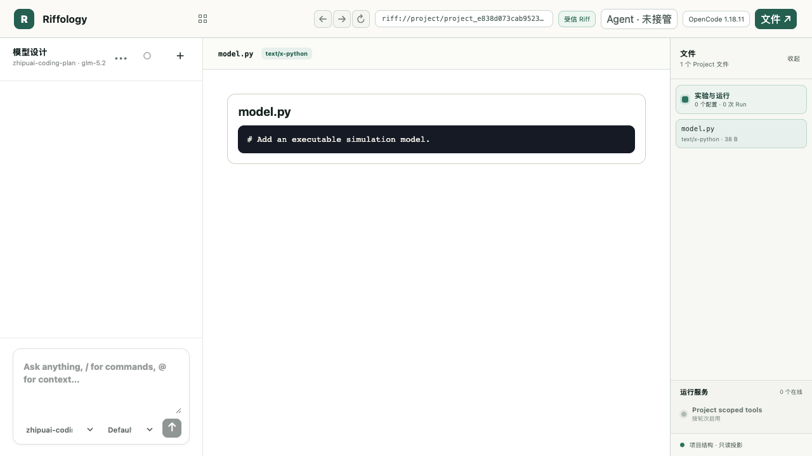
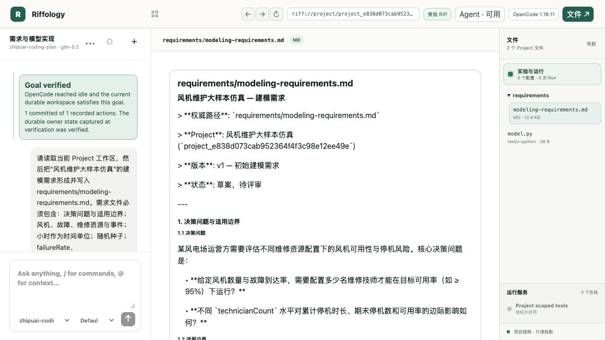
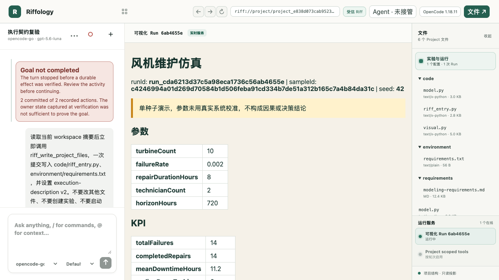
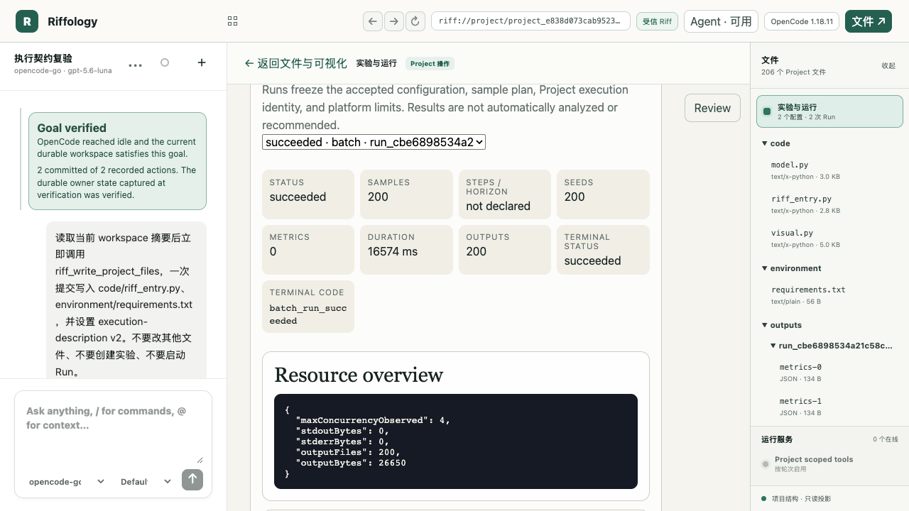
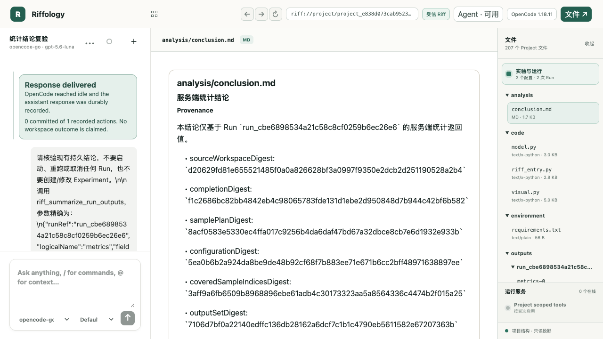
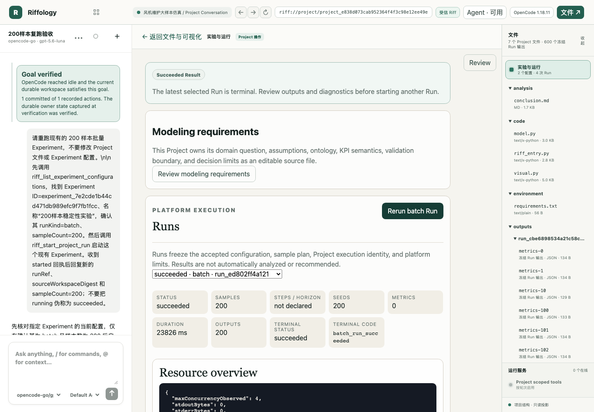

# Riff：从空白 Project 到大样本仿真结论

> 使用说明书与实机验收记录
> 验收日期：2026-08-13
> 验收案例：风机维护大样本仿真
> Riff Project：`project_e838d073cab952364f4f3c98e12ee49e`

## 1. 本说明书能带你完成什么

本说明书从一个真正的“空白 Project”开始，完整演示以下闭环：

1. 用一轮或多轮自然语言对话澄清问题，并把建模需求持久写入 Project；
2. 让 Agent 实现可执行的 Python 仿真、批运行入口、可视化入口和 execution-description v2；
3. 创建并运行一个可视化 Experiment，检查参数、状态和 KPI；
4. 创建并运行一个包含 200 个随机种子的 batch Experiment；
5. 先核验 Run 完成状态和输出覆盖，再用 `riff_summarize_run_outputs` 计算服务端统计；
6. 把可审计结论持久写入 `analysis/conclusion.md`；
7. 对同一 Experiment 执行 Rerun，以新 Run 的独立冻结证据确认流程可复现执行。

### 1.1 必须先理解的权威性边界

Project 中的源文件以及平台冻结、校验过的 Run 配置、完成记录和输出，是本流程的权威状态。Agent 回复、HTML、DOM、可视化页面和本说明书中的截图只是投影，便于理解和复核，不能替代持久文件或 Run 证据。

因此，看到“Agent 说已完成”还不够。每一步都应检查对应的持久结果：

- 需求阶段：`requirements/modeling-requirements.md` 已写入，且 UI 显示 `Goal verified`；
- 模型阶段：代码、依赖文件和 execution-description v2 已提交，Project 显示 execution ready；
- 运行阶段：Run 已进入明确的终态，并有冻结摘要、完成摘要和输出；
- 分析阶段：服务端统计覆盖完整输出，结论文件已持久写入 Project；
- 复跑阶段：产生一个新的 Run ID，不能把旧 Run 重新命名为复跑结果。

## 2. 验收环境和案例参数

本次实机流程使用 OpenCode 1.18.11。实际 Project 从 `creationSource=blank` 创建，最初只有一个 38 B 的 `model.py` 占位文件。

案例固定参数如下：

| 参数 | 值 | 含义 |
| --- | ---: | --- |
| `turbineCount` | 10 | 风机数量 |
| `failureRate` | 0.002 | 单位时间故障率 |
| `repairDurationHours` | 8 | 单次维修时长（小时） |
| `technicianCount` | 2 | 维修技师数量 |
| `horizonHours` | 720 | 仿真时域（小时） |

可视化 Run 使用随机种子 `42`；大样本 Run 使用 200 个连续随机种子 `1001..1200`。

开始前应确认：

- 首页 Provider 发现结果为可用状态；
- 已选择有权限的 Provider / Model；
- Project 页面右下角 `Project scoped tools` 已连接；
- 当前没有尚未结束的 Run。运行期间，代码、依赖和执行契约会被执行锁保护。

## 3. 新建空白 Project

1. 在首页点击 `New Project`。
2. 在“项目名称”输入 `风机维护大样本仿真`。
3. 在“创建方式”选择 `空白 Project`，不要选择模板或导入归档。
4. 选择当前可用的 Provider / Model。
5. 点击“创建项目”。Project 与首个 Conversation 会在同一持久事务内创建。
6. 进入工作台后，检查右侧文件栏。此时只有占位 `model.py`，实验和 Run 数量均为 0。



图 1 的关键验收信号是“1 个 Project 文件”“0 个配置 · 0 次 Run”，以及 `model.py` 中的占位注释。此时不能启动仿真，也不应由渲染器静默补齐模型数据。

## 4. 用自然语言形成建模需求

### 4.1 第一轮：提出业务问题和边界

在左侧 Conversation 输入一段自然语言需求。可以使用下面的示例：

```text
请读取当前 Project 工作区，然后为“风机维护大样本仿真”形成建模需求，
并写入 requirements/modeling-requirements.md。

需求要覆盖：决策问题与适用边界；风机、故障、维修资源与事件；
turbineCount、failureRate、repairDurationHours、technicianCount、
horizonHours 和随机种子；totalFailures、completedRepairs、
meanDowntimeHours、endingDownTurbines、availability 五个 KPI；
验证方法、未校准边界和非因果声明。
```

### 4.2 多轮澄清：把不确定性留在需求文件中

如业务语义还不完整，可继续对话，例如：

```text
请补充以下约束：技师为共享资源；同一风机停机期间不能重复故障；
维修完成后风机恢复运行；availability 的分母为风机数乘仿真时域；
当前没有真实运维数据，不要声称完成校准，也不要给出因果结论。
```

多轮对话的目标不是让聊天文本越来越长，而是让一个明确、可审阅的 Project 文件成为最终需求基线。

### 4.3 验收需求写入

Agent 完成后：

1. 检查左侧出现绿色 `Goal verified`；
2. 在右侧文件树展开 `requirements`；
3. 打开 `requirements/modeling-requirements.md`；
4. 核对决策问题、实体与事件、参数、KPI、验证边界和结论边界均已落盘。

本次验收文件为：

- 路径：`requirements/modeling-requirements.md`
- 大小：12,660 B
- SHA-256：`381b1509310109197ddac004d2aab60defcfe832110b6bb4720073d8c21e7068`



## 5. 建立可执行、可视化的仿真模型

在同一 Conversation 中继续输入：

```text
请依据 requirements/modeling-requirements.md 实现可执行的 Python 仿真模型。
需要提交模型源码、批运行入口、可视化入口、依赖文件和
execution-description v2；同时支持 visual 与 batch Run。

输入契约使用 JSON Schema 2020-12，$schema 必须精确为
https://json-schema.org/draft/2020-12/schema。
输出 metrics.json，角色为 data，包含需求文件定义的五个 KPI。
请先做轻量自检，但暂时不要创建 Experiment 或启动 Run。
```

Agent 应显式提交文件和执行契约，而不是只在回复中粘贴代码。本次验收的持久文件为：

| Project 文件 | 大小 | SHA-256 |
| --- | ---: | --- |
| `model.py` | 3,081 B | `4c43bcf8d86a812c50d4926d5278b7fff1be65ea780f0bf560d8afa86d6728b8` |
| `code/model.py` | 3,081 B | `4c43bcf8d86a812c50d4926d5278b7fff1be65ea780f0bf560d8afa86d6728b8` |
| `code/riff_entry.py` | 2,828 B | `c4f51eb9131308c7a0239dde540dccd7eb9a24ffd5867bdd222c0ff07af74933` |
| `code/visual.py` | 5,104 B | `ee07d1d358c7c916e467549c1751bd86a63e9736350d82da179c74b1c64f7cd1` |
| `environment/requirements.txt` | 56 B | `6174f6e7bd74e05c083c52b2e0e88e6c82c1ac6b7169617d8889f4df36864b64` |

execution-description v2 的关键内容应为：

- `runtime=python`，`runMode=both`；
- batch 入口为 `code/riff_entry.py`，协议为 `riff-batch-v1`；
- visual 入口为 `code/visual.py`，协议为 `riff-visual-v1`，健康检查为 `/health`；
- 输入 schema 拒绝未声明字段，并对各参数设置类型和范围；
- 每个样本必须发布 `metrics.json`，媒体类型为 `application/json`，角色为 `data`；
- 取消约定为 `SIGTERM`，并给出有限宽限时间。

在“实验与运行”页面确认 Project 已不再显示 `Execution setup required`，再进入下一步。

## 6. 创建并检查可视化仿真

### 6.1 创建可视化 Experiment

可直接在“实验与运行”面板新建配置，也可以继续用自然语言：

```text
请创建名为“单样本视觉演示”的 visual Experiment，
参数为 turbineCount=10、failureRate=0.002、repairDurationHours=8、
technicianCount=2、horizonHours=720，使用 single seed=42；
然后启动 visual Run。不要修改 Project 源文件。
```

本次实机 Experiment ID 为：

`experiment_54b3dcc2b2e9c5dc2bead1f31cd82471`

### 6.2 打开真实可视化服务

1. 在 Runs 区域选择状态为 `running` 的 visual Run；
2. 点击 `Embed visual simulation`，或点击 `Open restricted visual frame` 后按页面提示继续；
3. 核对页面中显示的 `runId`、`sampleId` 和 `seed=42`；
4. 核对参数表与冻结配置一致；
5. 查看 KPI 和边界声明；
6. 验收完成后点击 `Cancel Run`，让视觉服务进入明确终态。

本次视觉 Run 的证据为：

- Run ID：`run_cda6213d37c5a98eca1736c56ab4655e`
- Sample ID：`c4246994a01d269d70584b1d506feba91cd334b7de51a312b165c7a4b84da31c`
- 冻结源工作区摘要：`d20629fd81e655521485f0a0a826628bf3a0997f9350e2dcb2d251190528a2b4`
- 样本计划摘要：`0cae06c77777ac9122c11aff06647e9a6275474150b4a226bfbf807a7db45d0d`
- 配置摘要：`5aded07291a37830c4b9820955019001c3ebb39518e3852c82cd792b81a1f16c`
- 完成摘要：`d883916958a511cf8e4bd389eafe32b81805031ef3e50d70f24f6bf8e0f863d3`
- 健康检查：已验证；最终状态：`cancelled`；终态码：`user_cancelled`



该单样本画面显示 `totalFailures=14`、`completedRepairs=14`、`meanDowntimeHours=11.2`、`endingDownTurbines=0`、`availability=0.9844`。这些数值只用于验证模型可运行和可视化链路，不应被解释为总体统计结论。

> 图 3 左侧的红色卡片来自当时已修复的目标分类误判：该轮只创建 Experiment/Run，却被旧逻辑错误要求 Project 文件写入证据。它不否定右侧真实视觉服务和冻结 Run 证据。判断运行是否存在，应以 Run 状态和摘要为准。

## 7. 建立并运行 200 样本 Experiment

在 Conversation 中输入：

```text
请创建名为“200样本稳定性实验”的 batch Experiment。
模型参数保持 turbineCount=10、failureRate=0.002、
repairDurationHours=8、technicianCount=2、horizonHours=720；
使用 multiple-seeds，随机种子为 1001 到 1200，共 200 个样本。
创建后启动 batch Run，不要修改 Project 源文件。
```

也可在“实验与运行”面板完成同样操作：把 `runKind` 设置为 `batch`，粘贴参数和 200 个种子的配置，保存后点击 `Start batch Run`。

本次实机 Experiment ID 为：

`experiment_7e2cde1b44cd471db989efc9f7fb1fcc`

运行期间不要重启 Backend 或 OpenCode，也不要修改受执行锁保护的代码与契约。等待 Run 从 `queued/running` 进入终态，然后检查：

- `Status=succeeded`；
- `Samples=200`，`Seeds=200`；
- `Outputs=200`，即每个样本恰有一个必需输出；
- `Terminal status=succeeded`；
- `Terminal code=batch_run_succeeded`。

本次首轮 batch Run 的权威证据为：

| 字段 | 值 |
| --- | --- |
| Run ID | `run_cbe6898534a21c58c8cf0259b6ec26e6` |
| 状态 | `succeeded` |
| 样本数 / 种子数 / 输出数 | `200 / 200 / 200` |
| 冻结源工作区摘要 | `d20629fd81e655521485f0a0a826628bf3a0997f9350e2dcb2d251190528a2b4` |
| 样本计划摘要 | `8acf0583e5330ec4ffa017c9256b4da6daf47bd67a32dbce8cb7e6d1932e933b` |
| 配置摘要 | `5ea0b6b2a924da8be9de48b92cf68f7b883ee71e671b6cc2bff48971638897ee` |
| 完成摘要 | `f1c2686bc82bb4842eb4c98065783fde131d1ebe2d950848d7b944c42bf6b582` |
| 持续时间 | `16574 ms` |
| 资源摘要 | `maxConcurrencyObserved=4`，`outputFiles=200`，`outputBytes=26650` |



## 8. 从完整输出得到可信统计结论

### 8.1 不要直接让 Agent“看几条后总结”

分析必须绑定一个明确且成功的 Run，并证明输出覆盖完整。本次使用专门的服务端汇总工具 `riff_summarize_run_outputs`，避免因聊天上下文截断、分页遗漏或手工抄录导致统计错误。

在 Conversation 中输入：

```text
请分析最近一次 succeeded 的 200 样本 batch Run，并把持久结论写入
analysis/conclusion.md。

先确认目标 runRef=run_cbe6898534a21c58c8cf0259b6ec26e6 的
status=succeeded、plannedSampleCount=200、completedSampleCount=200，并记录 completionDigest。然后对 logicalName=metrics 调用
riff_summarize_run_outputs，统计 totalFailures、completedRepairs、
meanDowntimeHours、endingDownTurbines、availability 的 count、mean、
sampleStdDev、min、P50、Type-7 P95 和 max；同时给出
endingDownTurbines 的非零样本数与比例。

结论文件必须记录 sourceWorkspaceDigest、completionDigest、
samplePlanDigest、configurationDigest、outputSetDigest、
outputHashesDigest、statisticsDigest、完整覆盖证明和未校准/非因果边界。
不要用抽样输出代替完整统计，也不要手算重算服务端结果。
```

### 8.2 检查完整性证明

本次服务端汇总返回：

- `completeOutputCoverage=true`；
- `outputCount=200`；
- `coveredSampleIndicesDigest=3aff9a6fb6509b8968896ebe61adb4c30173323aa5a8564336c4474b2f015a25`；
- `outputSetDigest=7106d7bf0a22140edffc136db28162a6dcf7c1b1c4790eb5611582e67207363b`；
- `outputHashesDigest=6c846fa33e47206f095c80e0d2f4c0624f2ea9407b23dcb33c771e2f6a49f188`；
- `statisticsDigest=a1487ac0a027276b697c3735754ae49bef236e245f6bbf1596d11c594a5c9bc2`；
- 分位数算法：`linear_type_7`。

若 `completeOutputCoverage` 不为 true、样本索引不覆盖 `0..199`、Run 未成功，或 provenance 与目标 Run 不一致，应停止结论写入并先修复证据缺口。

### 8.3 本次 200 样本统计

以下数值是 `riff_summarize_run_outputs` 的服务端结果。为便于阅读，正文保留合理小数位；持久结论文件保留服务端原始浮点值。

| KPI | count | mean | sampleStdDev | min | P50 | P95（Type-7） | max |
| --- | ---: | ---: | ---: | ---: | ---: | ---: | ---: |
| `totalFailures` | 200 | 13.985 | 3.836452 | 5 | 14 | 20.05 | 24 |
| `completedRepairs` | 200 | 13.850 | 3.807887 | 5 | 14 | 20.05 | 24 |
| `meanDowntimeHours` | 200 | 11.1605 | 3.074222 | 4 | 11.2 | 16.515 | 19.3 |
| `endingDownTurbines` | 200 | 0.135 | 0.396942 | 0 | 0 | 1 | 3 |
| `availability` | 200 | 0.984496 | 0.004270 | 0.9732 | 0.9844 | 0.9911 | 0.9944 |

`endingDownTurbines` 非零的样本为 24 个，占 `24/200=12%`。

### 8.4 验收持久结论

分析完成后，在右侧文件树打开 `analysis/conclusion.md`，检查它不是一条聊天回复，而是 Project 持久文件。本次文件证据为：

- 路径：`analysis/conclusion.md`
- 大小：1,784 B
- SHA-256：`db2ce52b02f26aa22d6ea2f6049dd572e26faad6e55fb4a7298e79c1787a13ed`
- 更新时间：`2026-08-13T11:33:38.537Z`



### 8.5 如何解读结果

在当前冻结参数和 200 个随机种子下，平均发生约 13.985 次故障，平均完成 13.85 次维修；12% 的样本在时域末仍有至少一台风机停机。可用度中位数为 0.9844，Type-7 P95 为 0.9911，样本最小值为 0.9732。

这些是“给定模型和配置下”的条件性模拟统计。该示例模型没有使用真实运维数据校准，没有进行外部验证，也没有建立可识别的因果设计。因此：

- 不能把 0.984496 解释为真实风场可用度预测；
- 不能从本次单一配置得出“2 名技师优于其他配置”的因果结论；
- 不能直接把结果当作维护排班、运营或投资建议；
- 若要支持决策，应补充真实数据校准、替代配置对照、敏感性分析和独立验证。

## 9. Rerun：证明同一配置能再次独立执行

回到“实验与运行”页面，选择已结束的 `200样本稳定性实验` 和对应 Run。若当前 Project 工作区摘要与该 Run 的冻结源摘要一致，按钮会显示 `Rerun batch Run`。

1. 点击 `Rerun batch Run`；也可在 Conversation 中要求“对同一 200 样本 Experiment 发起一次新的 Rerun，不修改模型或配置”。
2. 确认生成了新的 Run ID；旧 Run ID 不应被覆盖。
3. 等待新 Run 达到 `succeeded`。
4. 再次检查 `Samples=200`、`Seeds=200`、`Outputs=200` 和 `batch_run_succeeded`。
5. 对比两次 Run 的 `sourceWorkspaceDigest`、`samplePlanDigest`、`configurationDigest` 和完成摘要。新的 Run ID 和独立完成记录证明它确实重新执行；相同的样本计划与配置摘要证明实验条件未变。若两次 Run 之间新增了持久 Project 文件，源工作区摘要应如实变化，不能为了追求摘要相同而隐藏变化。

本次复跑已产生独立成功证据：

| 字段 | 值 |
| --- | --- |
| 新 Run ID | `run_ed802ff4a121d1db54da0ae27e89ba1d` |
| 状态 / 终态码 | `succeeded / batch_run_succeeded` |
| 样本数 / 种子数 / 输出数 | `200 / 200 / 200` |
| 冻结源工作区摘要 | `35bdd633321b90d376f430828a229d8e01c9b83794acbf336ee42dc5011f4b06` |
| 样本计划摘要 | `8acf0583e5330ec4ffa017c9256b4da6daf47bd67a32dbce8cb7e6d1932e933b` |
| 配置摘要 | `5ea0b6b2a924da8be9de48b92cf68f7b883ee71e671b6cc2bff48971638897ee` |
| 完成摘要 | `aa0a7fdedece5c36770b465daaa1d37d6a2f801066caa155130e42916f0f79c2` |
| 输出资源 | `outputFiles=200`，`outputBytes=26650` |
| 完成时间 | `2026-08-13T11:42:14.009Z` |

复跑的 `samplePlanDigest` 和 `configurationDigest` 与首轮完全一致。`sourceWorkspaceDigest` 从首轮的 `d20629fd...` 变为 `35bdd633...`，原因是首轮之后先把 `analysis/conclusion.md` 作为 Project 权威文件持久写入，随后又追加了分析状态说明行；平台正确地把这些持久变化纳入最终 Run 的冻结工作区摘要。两次完成摘要不同，且复跑具有新的 Run ID，说明这是一次独立执行记录，而不是旧结果的重新标注。

本次最终复跑在最新代码下完成；Conversation 显示绿色 `Goal verified`，Runs 面板同时显示 `succeeded`、`Samples=200`、`Seeds=200`、`Outputs=200`。界面投影与权威 Run 状态一致。



## 10. 常见问题与故障排查

### 10.1 为什么 Provider 读取 Project 后看起来停止了？

现有证据不支持“Riff MCP 在读取后通用失败”这一判断。此前 GLM 轮次中，`riff_list_project_workspace` 和读取工具都已经正常返回；随后模型进入很长的隐藏推理和草稿生成阶段。观察到的两次长生成约为 46,372 字符 / 163 秒和 34,140 字符 / 109 秒，之后轮次被人工中止或因 Backend 重启结束，所以没有出现后续写入或最终回复。

也就是说，表象是“读完停止”，实质是“读工具已成功，模型仍在长时间生成；在写工具或最终回复前，外层执行被中止”。另一次真实轮次也证明模型最终能从读取继续到写入：它在约 46.5 秒、13,449 字符的生成后提交了文件。还有一次模型已经提交文件，但 Backend 恰在提交与最终文本之间重启，持久文件存在，Turn 却被映射为 `backend_restart`。

排查时应按以下顺序：

1. 先查看该轮的工具调用和工具返回，确认读取是否真的失败；
2. 再查看读取之后的模型流是否仍在生成；
3. 使用**精确 Project 工作目录**查询 OpenCode session status；`/session/status` 是目录作用域的，未带正确 `directory` 时返回 `{}` 不表示该 Project 已空闲；
4. 同时核对 Project 文件和 Run 的持久状态，避免只看聊天终态标签；
5. 活跃轮次正在生成时不要重启 Backend 或 OpenCode，也不要重复提交同一请求。

本地极小 canary 只用于确认链路可续写：在同一微型读写任务上，`glm-5.2` 约 23 秒，读到写的间隔约 4.75 秒；`gpt-5.6-luna` 约 10.6 秒，间隔约 1.97 秒。样本太小，不能当作普遍性能排名。`glm-5.2-highspeed` 虽可见，但当时账户没有对应 entitlement；这与普通 `glm-5.2` 的读取成功和长生成是两件事。

### 10.2 不要用错误目录的 `{}` 判断“已空闲”

OpenCode 的 session status 与工作目录绑定。Riff 为每个 Project 使用独立工作区，因此只有带上该 Project 精确目录的状态查询才能说明它是 `busy` 还是 `idle`。根目录或其他目录下的 `{}` 只能说明该作用域没有状态记录。

### 10.3 Agent 回复失败，但文件或 Run 已经存在

先看右侧 Project 文件、Experiment 和 Run 列表，再看写入 receipt 与 Run 完成记录。Backend 重启、客户端断线或终态映射可能使对话卡片显示失败，但已提交的 Project 文件不会因此自动消失。若持久写入存在，应从该状态继续，不要盲目重复覆盖。

### 10.4 batch Run 成功但不能形成结论

`succeeded` 只说明技术执行和声明输出校验通过。分析仍须满足：目标 Run 明确、完整覆盖 200 个输出、输出角色适合分析、provenance 一致、服务端摘要成功，并把结论持久写入 Project。缺少任一项都应标记为“运行成功、分析证据不足”。

### 10.5 可视化能打开，是否等于模型正确？

不等于。视觉页面是一个指定 Run 的投影。它可以证明入口、健康检查、冻结参数和页面渲染可用，但不能替代模型校准、逻辑验证、统计验证或因果识别。

## 11. 最终验收清单

- [x] Project 确认为 `blank` 创建，而不是模板或导入；
- [x] 建模需求已持久写入 `requirements/modeling-requirements.md`；
- [x] 可执行模型、依赖、batch/visual 入口和 v2 契约已提交；
- [x] visual Experiment 已创建，真实视觉服务已打开并核对；
- [x] 200 样本 batch Experiment 已成功，200 个输出均已发布；
- [x] `riff_summarize_run_outputs` 已提供完整覆盖证明和服务器端统计；
- [x] 结论已持久写入 `analysis/conclusion.md`；
- [x] 图 5 已从真实产品界面捕获，展示持久分析文件；
- [x] 已产生并记录第二个独立的 200 样本 Rerun 成功证据；
- [x] 文档明确说明当前示例未校准、非因果、非决策建议；
- [x] 所有截图均按投影处理，未替代 Project / Run 权威状态。

至此，本流程已构成“从空白 Project 到持久分析结论，并有独立复跑证据”的完整截图验收。
